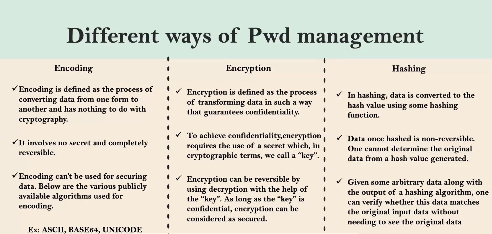
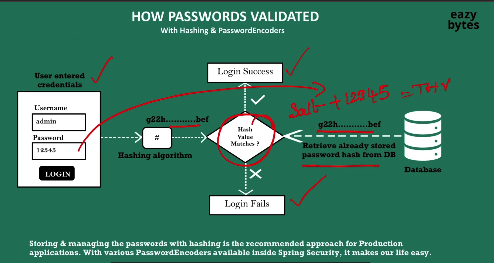
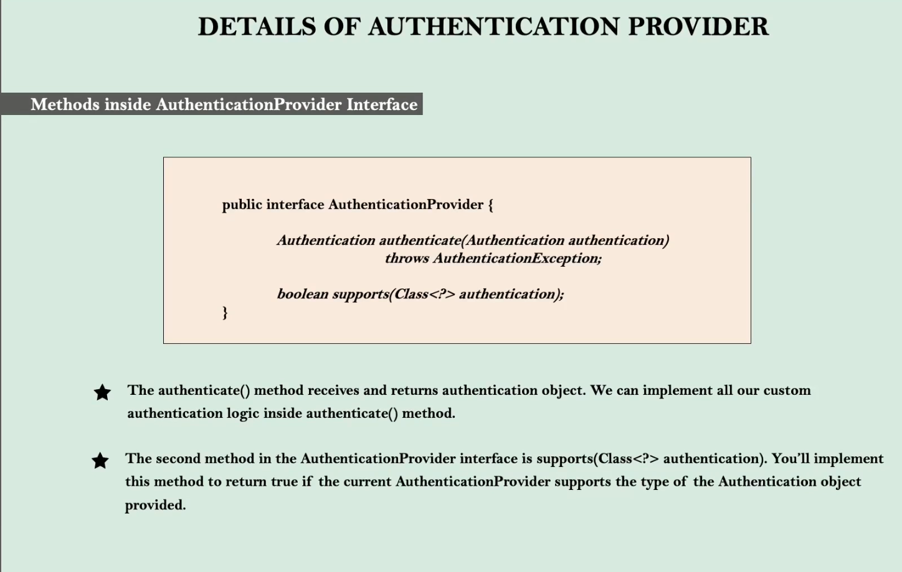
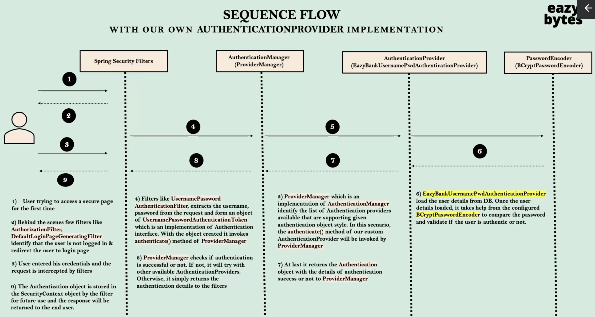
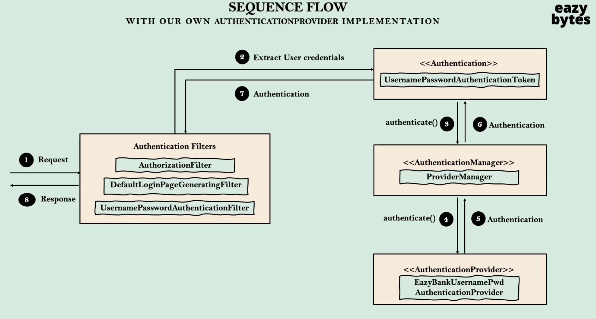

### ✏️ &nbsp;_학습 내용 정리_
___
<details>

<summary >&nbsp;Password Management </summary>

### Pwd Management



- **Encoding and Decoding**
    - 데이터를 한 형식에서 다른 형식으로 변환하는 과정
    - 기밀이 포함되지 않기 때문에 디코딩을 하면 쉽게 탈취 가능 즉, 일반적으로 사용하지 않음
    - ex ) ASCII, BASE64 등
- **Encryption**
    - 비밀 키를 제공해 데이터를 암호화 한다.
    - 암호화 된 비밀번호는 복호화 과정을 거쳐 원래의 비밀번호를 알 수 있다.
    - 암호화 알고리즘과 비밀키는 주로 백엔드 애플리케이션 내부에 기밀 데이터로 관리 된다.
- **Hashing**
    - **Hashing과 Spring Security**:
        - 해싱은 비밀번호를 보호하기 위한 중요한 기법.
        - 예: `BCryptPasswordEncoder`, `Argon2PasswordEncoder`, `PBKDF2PasswordEncoder` 등.
    - **생산 환경에서의 권장 사항**:
        - 비밀번호는 절대 원문으로 저장되지 않으며, 항상 해싱된 값으로 저장.
        - 데이터베이스 유출 시에도 해싱된 값만 공개되므로 원본 비밀번호를 보호할 수 있다.


### Password Validation Process


1. **User Input(사용자 입력)**
    - 사용자가 로그인 폼에 Username(admin)과 Password(12345)를 입력한다.
   2. **Hashing Algorithm**
       - 사용자가 입력한 비밀번호(12345)에 Salt를 추가한ㄷ.
           - Salt : 고유하고 무작위의 문자열로, 비밀번호의 보안을 강화하기 위해 사용된다.
           - ex) : Salt + 12345 = THV
           - Salt를 추가하면 같은 비밀번호라도 해시 값이 달라지므로, 데이터베이스 유출 시 공격자가 사전 공격으로 비밀번호를 추측하기 어렵게 만든다.
           - 결과적으로, 입력된 비밀번호와 Salt를 결합한 후, Hashing Algorithm을 통해 고유한 HashValue를 생성한다.
   3. **Database(저장된 해시 값 검색)**
       - 데이터베이스에서 사용자의 저장된 해시 값을 검색한다.
           - 저장된 값 : `g22h…bef`
           - 이 값은 사용자가 계정을 생성할 때 비밀번호를 해싱하여 저장한 값이다.
   4. Hash Value Comparison
       - 생성된 Hash Value와 데이터베이스에서 검색된 HashValue를 비교한다.
       - 이 비교과정에서 일치여부를 확인한다.
           - 일치(O) : 로그인 성공
           - 일치(X) : 로그인 실패


### Password Encoder 구현체

- **Password Encoder :**
    - Spring Security에서 제공하는 인터페이스로, 비밀번호를 해싱하거나 검증하기 위해 사용된다. 사용자 비밀번호를 안전하게 관리하기 위한 표준화된 메커니즘을 제공한다.
    - 즉, 해싱 및 검증을 쉽게 구현할 수 있다.
- **NoOpPasswordEncoder (실사용 추천x)**
    - 해싱, 인코딩, 암호화의 개념이 없으며, 비밀번호를 일반 텍스트로 취급
    - 일반 텍스트로 취급하기 때문에 추천하는 PasswordEncoder가 아니다.
- **StandardPasswordEncoder (실사용 추천x)**
    - 운영앱에서 추천하지 않음 → 사용중단
    - 레거시(과거 체계) 목적으로 남겨둔 것
- **Pbkdf2PasswordEncoder (실사용 추천x)**
    - 최근 CPU, GPU의 발전과 더불어 이것은 더 이상 안전하지 않다.
    - 고성능 GPU  기계를 갖고 있다면 손쉽게 해시값에 무차별 대입 공격을 가하고 일반 텍스트 비밀번호를 추측할 수 있다.
- **BCryptPasswordEncoder**
    - 주기적으로 업데이트가 된다.
    - matches 메소드를 실행하려고 하면 CPU연산을 요청한다. 즉, 밀리초 안에 실행할 수 있는 쉬운 Java코드가 아니다.
    - 인코더에 설정한 작업량 또는 라운드 수에 따라 이 해싱 알고리즘이 사용하는 CPU연산은 더 많아진다.
    - 이 인코더의 도움으로 비밀번호를 해싱했을 때 어떤 해커가 무차별 대입 공격을 하려고하면 해당 미션에 많은 연산 능력을 필요로 한다.
- **SCryptPasswordEncoder**
    - BCryptPasswordEncoder의 고급 버전
    - BCryptPasswordEncoder의 연산능력과, 상대방의 메모리 일부를 요구한다.
- **Argon2PasswordEncoder**
    - 최신 해싱 알고리즘
    - BCrypt와 SCypt에서 사용되는 연산 능력, 메모리 요구
    - 다중 스레드를 필요로 한다.

</details>

<br>

<details>
    <summary>
    &nbsp;Authentication Provider
    </summary>


### Details of Authentication Provider


- **AuthenticationProvider 인터페이스 란?**
  - SpringSecurity의 인증을 처리하기 위한 인터페이스이다.
  - 사용자 정의 인증 로직을 구현할 때 이 인터페이스를 구현하여 사용한다.

- **AuthenticationProviders 인터페이스 내부 메소드**
    - `authenticate(Authentication authentication)`
      - 인증 로직을 정의하는 메서드이다.
      - 입력받은 `Authentication` 객체를 처리하여 인증이 성공하면 인증된 객체를 반환하고, 실패하면 예외를 발생시킴
      - 예제 구현 
          ```java
        @Override
        public Authentication authenticate(Authentication authentication) throws AuthenticationException {
        String username = authentication.getName();
        String password = authentication.getCredentials().toString();

            // Custom authentication logic
            if ("user".equals(username) && "password".equals(password)) {
            return new UsernamePasswordAuthenticationToken(username, password, new ArrayList<>());
            } else {
            throw new BadCredentialsException("Authentication failed");
            }}
  - `supports(Class<?> authentication)`
    - 이 `AuthenticationProvider`가 특정 유형의 인증 요청을 처리할 수 있는지 확인한다.
    - 반환값
      - true : AuthenticationProvider가 주어진 인증 타입을 지원함
      - false : 지원하지 않음
    - 예제 구현
      ```java
      @Override
      public boolean supports(Class<?> authentication) {
      return authentication.equals(UsernamePasswordAuthenticationToken.class);
      }


<br>
      
### Sequence Flow



- **1. 사용자 요청**
  - 사용자가 보안이 적용된 페이지에 처음 접근하려고 시도한다.
  - Spring Security는 사용자의 인증상태를 확인한다.
- **2. Spring Security 필터**
  - Spring Security는 다양한 필터를 통해 인증 흐름을 제어합니다.
  - 대표적인 필터:
    - AuthorizationFilter : 사용자의 인증 상태를 확인.
    - UsernamePasswordAuthenticationFilter : 사용자 이름과 비밀번호를 처리.
    - DefaultLoginPageGeneratingFilter : 인증되지 않은 사용자를 로그인 페이지로 리다이렉트
- **3. 사용자 자격 증명 입력**
  - 사용자가 로그인 페이지에서 아이디와 비밀번호를 입력한다.
  - 입력된 자격 증명은 이후 필터 체인으로 전달된다.
- **4. UsernamePasswordAuthenticationFilter**
  - UsernamePasswordAuthenticationToken 객체를 생성한다.
    - 이 객체는 사용자 이름과 비밀번호를 포함한다.
  - 생성된 객체는 AuthenticationManager로 전달된다.
- **5. AuthenticationManager**
  - SpringSecurity의 ProviderManager은 AuthenticationManager의 기본 구현체로, 인증 요청을 처리할 수 있는 AuthenticationProvider 목록을 관리한다.
  - supports 메서드를 호출하여 요청을 처리할 수 있는 AuthenticationProvider을 확인한다.
  - 해당 예제는 AuthenticationProvider(UsernamePwdAuthenticationProvider)가 선택 된다.
- **6. CustomAuthenticationProvider**
  - authenticate 메서드를 구현하여 사용자 인증 로직을 처리한다.
    - 사용자의 username을 기준으로 데이터베이스에서 사용자 정보를 검색
    - 비밀번호는 PasswordEncoder를 사용하여 비교
  - 비밀번호 검증 성공 : 인증된 Authentication 객체를 반환
  - 비밀번호 검증 실패 : 인증 예외 (BadCredentialException)를 발생
- **7. PasswordEncoder**
  - 비밀번호를 안전하게 관리하기 위해 암호화된 비밀번호를 비교한다.
  - 여기서는 BCryptPasswordEncoder을 사용
  - PasswordEncoder.mathces 메서드 : 비밀번호 일치 여부를 확인
- **8. 인증 성공 또는 실패**
  - 인증 성공 :
    - 인증된 Authentication 객체가 반환
    - 이 객체는 SecurityContext에 저장되어 이후 요청에서 재사용
  - 인증 실패 :
    - 인증 예외가 발생하며, 사용자는 다시 로그인 페이지로 리다이렉트된다.
- **9. 인증 결과 처리**
  - 성공 시 :
    - 사용자는 요청한 리소스에 접근 가능
    - SecurityContext에 인증 정보를 저장
  - 실패 시 :
    - 인증 실패 메세지를 사용자에게 반환하고 로그인 페이지로 리다이렉트

</details>
